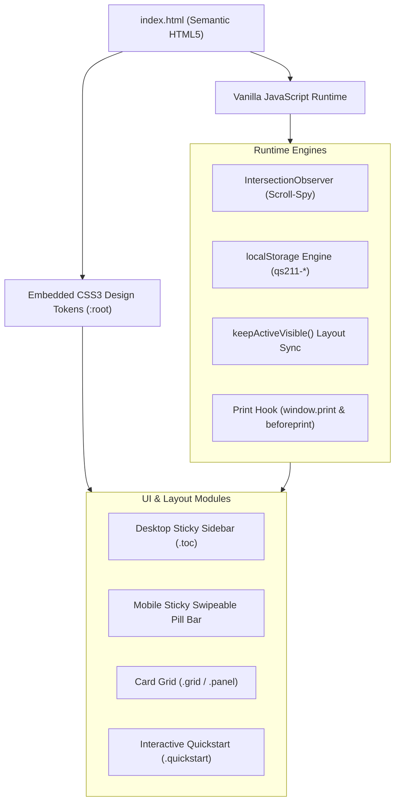
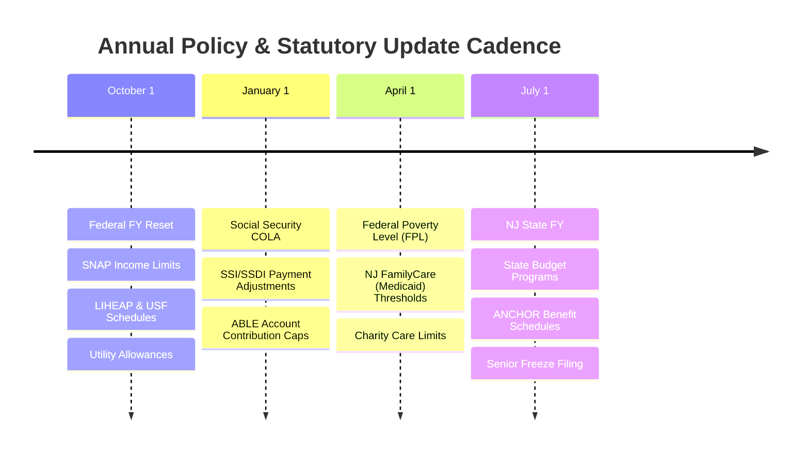

# 211 NJ Help — Sicklerville / 08081

> **A localized, hyper-accessible, zero-dependency civic benefits navigator and crisis playbook for Sicklerville, Winslow Township, and Camden County, New Jersey.**

[](#technical-architecture)
[-brightgreen)](#zero-dependency--offline-resilience)
[-orange)](file:///c:/Users/Ryan/Desktop/211nj-help/index.html)
[](file:///c:/Users/Ryan/Desktop/211nj-help/docs/LOCAL_RESOURCES_CAMDEN_COUNTY.md)
[](file:///c:/Users/Ryan/Desktop/211nj-help/docs/MAINTENANCE_AND_VERIFICATION.md)

---

## Table of Contents

- [Overview & Mission](#overview--mission)
- [Target Family Context & Design Purpose](#target-family-context--design-purpose)
- [Key Features & Capabilities](#key-features--capabilities)
- [Directory & Program Taxonomy (26 Sections)](#directory--program-taxonomy-26-sections)
- [Technical Architecture](#technical-architecture)
- [Quick Start & Local Usage](#quick-start--local-usage)
- [Printing & Emergency Binder Generation](#printing--emergency-binder-generation)
- [Verification & Annual Update Lifecycle](#verification--annual-update-lifecycle)
- [Documentation Suite](#documentation-suite)
- [Contributing & Agent Guidelines](#contributing--agent-guidelines)
- [License & Disclaimer](#license--disclaimer)

---

## Overview & Mission

Navigating New Jersey's social safety net is notoriously challenging. Critical resources—ranging from energy assistance (LIHEAP, USF) and healthcare (NJ FamilyCare, Medicaid) to disability income (SSI, SSDI, DAC), special education rights (IEPs), emergency housing aid, and local community pantry networks—are dispersed across dozens of county, state, and federal agencies. Program applications are complex, eligibility matrices change annually, and missed renewal deadlines routinely cause families to lose life-saving benefits.

**`211nj-help`** solves this by condensing the entire civic support landscape into a **single, portable, zero-dependency, print-ready web portal**: [`index.html`](file:///c:/Users/Ryan/Desktop/211nj-help/index.html).

Built specifically for residents of **Sicklerville (ZIP 08081) / Winslow Township in Camden County, NJ**, this portal eliminates bureaucratic noise, offering direct application links, plain-language eligibility guidelines, concrete phone scripts, and practical advocacy strategies.

---

## Target Family Context & Design Purpose

While the guide is directly applicable to any low- or moderate-income household in Camden County, it was custom-architected around a real-world neurodivergent family profile:
* **Ryan**: Working adult managing chronic back pain/medical costs while navigating household logistics.
* **Fiancée**: Adult with autism spectrum disorder and severe executive/phone anxiety.
* **Child**: School-aged child diagnosed with Asperger's / Autism Spectrum Disorder with active special education needs (IEP).

### How This Profile Shaped Every Design Decision:
1. **Low Cognitive Load & Visual Hierarchy**: Built using clean Google-inspired design principles with distinct card panels (`.panel`), rounded containers, high contrast ratios, and color-coded tags (`.tag`) that minimize sensory overload.
2. **Anxiety-Free Pathways**: Direct callouts for texting 211 (`898-211`), online self-service portals, authorized representative forms, and reasonable accommodations under the Americans with Disabilities Act (ADA).
3. **Exact Scripting**: Literal word-for-word conversational scripts for talking with agency caseworkers and utility representatives (`"I want to file an application today, even if it's incomplete"`, `"I have a disability and I'm asking for a reasonable accommodation"`).
4. **The Marriage Analysis**: A dedicated, research-backed examination of the federal Supplemental Security Income (SSI) marriage penalty, Childhood Disability Benefits (DAC) forfeiture rules, and the legal alternatives (Healthcare Proxy, Durable Power of Attorney).
5. **Autism & Developmental Disability Focus**: Highlighting underutilized state programs like PerformCare Children's Mobile Response & Stabilization Services (home visits within 1 hour for behavioral crises), the Camden County Blue Envelope program for traffic stops, and the NJ Division of Developmental Disabilities (DDD) Supports Program.

---

## Key Features & Capabilities

### 1. Interactive Quickstart Checklist
* **8 Critical First Steps**: Prioritizes 211 benefits screening, tri-utility energy aid, NJ FamilyCare health coverage, NJ SHARES water/energy grants, DDD developmental intake, MyNJHelps cash/SNAP/childcare aid, VITA free tax prep, and crisis lifelines.
* **Persistent Progress**: Checkboxes sync instantly to browser `localStorage` using key namespace `qs211-*`. State survives reloads, accidental tab closures, and device restarts.
* **Progress Tracking**: Real-time percentage indicator, completion counter (`X of 8 complete`), animated blue-to-green progress bar, and completion banner.
* **One-Click Reset**: Dedicated reset button to clear local storage and start over.
* **Accessible Hit Targets**: Full-width clickable list items allow tapping anywhere on a row to toggle checkboxes.

### 2. Dual-Mode Responsive Navigation
* **Desktop (>820px)**: A sticky left sidebar (`.toc`) displaying all 26 sections, color-coordinated list counters, and an `IntersectionObserver`-powered scroll-spy that highlights the active section in real time.
* **Mobile (≤820px)**: Automatically morphs into a sticky, horizontally swipeable pill-tab bar at the top of the viewport. Features touch-friendly scroll-snapping, backdrop blur (`backdrop-filter: blur(6px)`), and active chip auto-centering via smooth JavaScript scroll offsets.

### 3. Print & PDF Publishing Engine
* **Native Print Button & Dedicated Print Stylesheet (`@media print`)**:
  - Hides floating buttons (`#top-btn`, `#print-btn`) and reset controls.
  - Converts colored backgrounds into ink-efficient, high-contrast monochrome layouts.
  - Applies `break-inside: avoid` on panels and checklist blocks to eliminate awkward page-break splits.
  - Flattens navigation for clean physical paper binders or permanent PDF archival.

### 4. Zero-Dependency & Offline Resilience
* **Zero External HTTP Requests**: No CDNs, no Google Fonts calls, no third-party JavaScript libraries, and no analytics trackers.
* **100% Offline Capability**: Runs seamlessly via the `file://` protocol from a local hard drive, USB flash drive, or phone file manager.
* **Microsecond Render Time**: Near-instantaneous First Contentful Paint (FCP) and Time to Interactive (TTI).

### 5. Verified Data & Candor Protocol
* **Verified Badges**: Clear `.verified-note` indicators show when figures were verified (October 2026).
* **Candor Warnings (`.unverified`)**: Any item subject to county-level policy variance, pending legislation (such as H.R. 1389 Marriage Equality for Disabled Adults), or seasonal program hours is prominently flagged in yellow with actionable verification notes.

---

## Directory & Program Taxonomy (26 Sections)

All sections are defined inside [`index.html`](file:///c:/Users/Ryan/Desktop/211nj-help/index.html) with unique anchor IDs:

| # | Anchor ID | Section Name | Focus & Highlighted Programs |
|---|---|---|---|
| 1 | [`#quickstart`](file:///c:/Users/Ryan/Desktop/211nj-help/index.html#L583) | **Quickstart checklist** | 8 high-impact actions, interactive checkboxes, localStorage state |
| 2 | [`#cash`](file:///c:/Users/Ryan/Desktop/211nj-help/index.html#L624) | **Cash assistance & disability income** | WFNJ (TANF/GA), SSI, SSDI, NJ ABLE accounts (age-46 rule) |
| 3 | [`#childcare`](file:///c:/Users/Ryan/Desktop/211nj-help/index.html#L682) | **Child care & school support** | CCAP child care subsidies, Child Study Team, IEPs, SPAN advocacy |
| 4 | [`#clothing`](file:///c:/Users/Ryan/Desktop/211nj-help/index.html#L724) | **Clothing & household goods** | Cathedral Kitchen Clothes Closet, St. Vincent de Paul, Buy Nothing |
| 5 | [`#crisis`](file:///c:/Users/Ryan/Desktop/211nj-help/index.html#L754) | **Crisis & emergency help** | 988 Lifeline, Oaks Integrated Care Camden Crisis, MRSS, 1-800-572-SAFE |
| 6 | [`#disability`](file:///c:/Users/Ryan/Desktop/211nj-help/index.html#L801) | **Disability & developmental services** | DDD Supports Program, DDS, PASP personal assistance, NJ WorkAbility |
| 7 | [`#employment`](file:///c:/Users/Ryan/Desktop/211nj-help/index.html#L856) | **Employment & job training** | Camden County One-Stop, DVRS vocational rehabilitation, Ticket to Work |
| 8 | [`#food-health`](file:///c:/Users/Ryan/Desktop/211nj-help/index.html#L887) | **Food & health insurance** | NJ SNAP, WIC, NJ FamilyCare, Special Child Health Services |
| 9 | [`#food-pantries`](file:///c:/Users/Ryan/Desktop/211nj-help/index.html#L914) | **Food pantries & free meals** | Community Care Pantry (Sicklerville), Food Bank of South Jersey |
| 10 | [`#home-repair`](file:///c:/Users/Ryan/Desktop/211nj-help/index.html#L945) | **Home repair & improvement** | Camden County HIP ($20k forgivable), USDA 504 grants, Habitat SCNJ |
| 11 | [`#housing`](file:///c:/Users/Ryan/Desktop/211nj-help/index.html#L1015) | **Housing, rent & legal help** | Section 8, CCCOEO emergency rent, LSNJ eviction defense, HUD counseling |
| 12 | [`#income`](file:///c:/Users/Ryan/Desktop/211nj-help/index.html#L1072) | **Income eligibility (2026–2027)** | USF/LIHEAP/SNAP/Medicaid income threshold comparison tables |
| 13 | [`#kids`](file:///c:/Users/Ryan/Desktop/211nj-help/index.html#L1121) | **Kids: free fun & learning** | Jake's Place inclusive playground, Donio Park, Tall Pines Preserve |
| 14 | [`#library-passes`](file:///c:/Users/Ryan/Desktop/211nj-help/index.html#L1141) | **Free museum passes** | Camden County Library pass lending: 21 venues (Please Touch, Zoo, etc.) |
| 15 | [`#local`](file:///c:/Users/Ryan/Desktop/211nj-help/index.html#L1331) | **Local & county** | Winslow Municipal Hall, Camden County Store Voorhees, South County Library |
| 16 | [`#medical`](file:///c:/Users/Ryan/Desktop/211nj-help/index.html#L1445) | **Medical bills & mental health** | NJ Charity Care, PAAD / Senior Gold Rx, NeedyMeds, CAMcare clinics |
| 17 | [`#marriage`](file:///c:/Users/Ryan/Desktop/211nj-help/index.html#L1520) | **The marriage question** | SSI couples penalty ($497/mo loss), DAC loss, Healthcare Proxy alternative |
| 18 | [`#phone-internet`](file:///c:/Users/Ryan/Desktop/211nj-help/index.html#L1567) | **Phone, internet & devices** | Lifeline federal subsidy, Comcast Internet Essentials, PCs for People |
| 19 | [`#seniors`](file:///c:/Users/Ryan/Desktop/211nj-help/index.html#L1607) | **Seniors & older adults** | Senior Freeze (PTR), Camden Senior Services, SEN-HAN Transit |
| 20 | [`#more`](file:///c:/Users/Ryan/Desktop/211nj-help/index.html#L1650) | **Tax relief & credits** | NJ ANCHOR rebate, NJ EITC, Child Tax Credit, VITA free tax filing |
| 21 | [`#tips`](file:///c:/Users/Ryan/Desktop/211nj-help/index.html#L1717) | **Tips, tricks & money hacks** | Emergency playbook, phone scripts, legal benefit maximization hacks |
| 22 | [`#transportation`](file:///c:/Users/Ryan/Desktop/211nj-help/index.html#L2035) | **Transportation** | Dollar-A-Day auto insurance (SAIP), Access Link, Modivcare, SEN-HAN |
| 23 | [`#veterans`](file:///c:/Users/Ryan/Desktop/211nj-help/index.html#L2133) | **Veterans & military families** | Camden County Veterans Affairs, NJ Veterans Helpline, VA health |
| 24 | [`#utilities`](file:///c:/Users/Ryan/Desktop/211nj-help/index.html#L2161) | **Utility bill assistance** | LIHEAP, USF, PAGE, NJ SHARES, Winter Termination Program |
| 25 | [`#energy`](file:///c:/Users/Ryan/Desktop/211nj-help/index.html#L2236) | **Weatherization & efficiency** | Comfort Partners, Camden County Weatherization Assistance |
| 26 | [`#phones`](file:///c:/Users/Ryan/Desktop/211nj-help/index.html#L2278) | **Phone number cheat sheet** | Quick-dial 40+ agency directory for immediate emergency contact |

---

## Technical Architecture



For complete technical specifications, DOM schemas, responsive math, and browser performance metrics, refer to [`docs/ARCHITECTURE.md`](file:///c:/Users/Ryan/Desktop/211nj-help/docs/ARCHITECTURE.md).

---

## Quick Start & Local Usage

Because this portal contains no build step and zero dependencies, getting started is immediate:

### Option 1: Direct File Execution (Recommended for Offline/Personal Use)
Double-click [`index.html`](file:///c:/Users/Ryan/Desktop/211nj-help/index.html) or open it directly in any modern browser:
```powershell
# Windows PowerShell
Start-Process "c:\Users\Ryan\Desktop\211nj-help\index.html"
```

### Option 2: Local HTTP Server
If you prefer previewing over HTTP (e.g. testing service workers or local LAN sharing):
```powershell
# Using Python
python -m http.server 8080

# Using Node.js npx
npx serve .
```
Then visit `http://localhost:8080`.

---

## Printing & Emergency Binder Generation

Having physical copies of benefits documentation during winter storms, utility shutoffs, or broadband outages is vital.

1. Open [`index.html`](file:///c:/Users/Ryan/Desktop/211nj-help/index.html) in Chrome, Edge, Safari, or Firefox.
2. Click the floating **Print** button in the lower right corner, or press `Ctrl + P` (`Cmd + P` on macOS).
3. **Print Settings**:
   - **Destination**: Save as PDF or select your printer.
   - **Margins**: Default.
   - **Options**: Check **Background graphics** to preserve header bar tones and table cell striping.
4. The resulting document strips all navigation chrome, centers content, formats contact rows cleanly, and fits into standard 3-ring binder sleeves.

See [`docs/DEPLOYMENT_AND_OFFLINE_USAGE.md`](file:///c:/Users/Ryan/Desktop/211nj-help/docs/DEPLOYMENT_AND_OFFLINE_USAGE.md) for detailed offline guides.

---

## Verification & Annual Update Lifecycle

Program rules, income caps, and utility schedules follow strict statutory calendars:



Consult [`docs/MAINTENANCE_AND_VERIFICATION.md`](file:///c:/Users/Ryan/Desktop/211nj-help/docs/MAINTENANCE_AND_VERIFICATION.md) for the complete field-verification checklist, contact phone validation protocols, and instructions for resolving `.unverified` flags.

---

## Documentation Suite

The repository contains an exhaustive documentation suite in the [`docs/`](file:///c:/Users/Ryan/Desktop/211nj-help/docs) directory:

| Document | Purpose & Key Topics |
|---|---|
| [`docs/ARCHITECTURE.md`](file:///c:/Users/Ryan/Desktop/211nj-help/docs/ARCHITECTURE.md) | Single-file architecture, CSS tokens, responsive layout math, scroll-spy observer logic, localStorage state engine, print styling engine, and accessibility audit. |
| [`docs/PROGRAMS_AND_BENEFITS.md`](file:///c:/Users/Ryan/Desktop/211nj-help/docs/PROGRAMS_AND_BENEFITS.md) | In-depth programmatic reference for all 50+ benefits programs, income calculation formulas, the SSI/DAC Marriage Analysis, and legal benefit-maximization hacks. |
| [`docs/LOCAL_RESOURCES_CAMDEN_COUNTY.md`](file:///c:/Users/Ryan/Desktop/211nj-help/docs/LOCAL_RESOURCES_CAMDEN_COUNTY.md) | Granular municipal and county facility directory: Winslow Township Hall, Camden County BSS, South County Library, library museum pass inventory, and local pantries. |
| [`docs/MAINTENANCE_AND_VERIFICATION.md`](file:///c:/Users/Ryan/Desktop/211nj-help/docs/MAINTENANCE_AND_VERIFICATION.md) | Annual maintenance timetable, data audit checklist, phone number verification steps, and quality assurance procedures. |
| [`docs/DEPLOYMENT_AND_OFFLINE_USAGE.md`](file:///c:/Users/Ryan/Desktop/211nj-help/docs/DEPLOYMENT_AND_OFFLINE_USAGE.md) | How to use the portal offline, mobile home-screen setup, PDF printing, emergency go-bag preparation, and static web hosting (GitHub Pages, Vercel). |
| [`AGENTS.md`](file:///c:/Users/Ryan/Desktop/211nj-help/AGENTS.md) | Mandatory instructions, guardrails, code conventions, and behavioral boundaries for AI coding agents and human contributors working on this codebase. |

---

## Contributing & Agent Guidelines

Automated agents and human contributors modifying [`index.html`](file:///c:/Users/Ryan/Desktop/211nj-help/index.html) must adhere to the rules outlined in [`AGENTS.md`](file:///c:/Users/Ryan/Desktop/211nj-help/AGENTS.md). 

**Key Invariants:**
1. **Preserve Single-File Simplicity**: Do not introduce external CSS, npm packages, or bundlers without explicit architectural consensus.
2. **Synchronize Navigation**: Every new section (`<h2 class="section-title" id="...">`) must have a corresponding entry in `<nav class="toc">`.
3. **Respect Candor Standards**: If a program detail cannot be confirmed with official 2026/2027 state documentation, wrap it in `<p class="unverified">`.
4. **Maintain Print Fidelity**: Always verify that new layouts format properly under `@media print`.

---

## License & Disclaimer

**Public Information & Community Resource**: This repository contains compiled public sector information, statutory guidelines, and community resources. 

*Disclaimer: This portal is an independent community advocacy and benefits navigation tool. It is not an official publication of the State of New Jersey, Camden County, or NJ 2-1-1 Partnership. Always confirm program specifics with the respective administering agency before making legal, financial, or medical decisions.*
