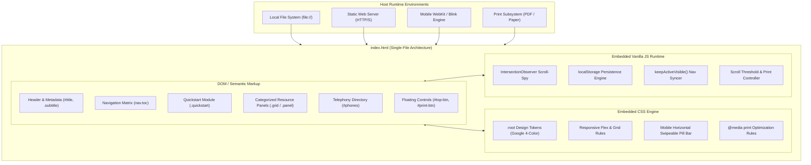
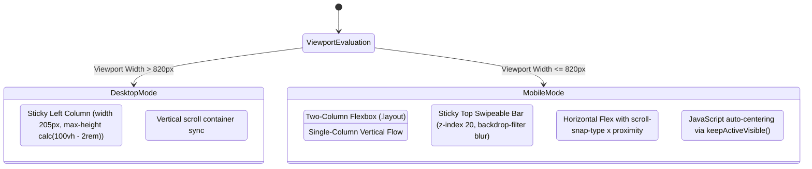

# System Architecture & Technical Specifications

> **Project**: `211nj-help`  
> **Source Code**: [`index.html`](file:///c:/Users/Ryan/Desktop/211nj-help/index.html)  
> **Architecture Pattern**: Single-File Zero-Dependency Progressive Web Architecture (PWA-Ready)

---

## 1. Architectural Philosophy: The Civic Resilience Paradigm

Most modern web applications rely on extensive toolchains: Node.js packages, Webpack or Vite bundlers, external component libraries, CDN-hosted fonts, and cloud databases. While powerful, this stack introduces severe vulnerabilities in crisis environments:
* **Fragility under Network Degradation**: If cellular networks or residential broadband fail (common during New Jersey winter storms or financial emergencies), remote script tags and CDNs fail to load, leaving users with blank screens.
* **Asset Path Breakage**: When non-technical users download, email, or copy web assets onto USB drives or smartphones, multi-file structures (separate `.css`, `.js`, and image assets) frequently break due to relative path mismatches.
* **Device Obsolescence**: Bulky JavaScript frameworks place heavy CPU and RAM burdens on low-cost smartphones or legacy computers used by low-income families.

**`211nj-help` adopts a Civic Resilience Architecture**:
1. **100% Self-Contained**: The complete application—markup, presentation styles, interactive state logic, and data—resides within a single file: [`index.html`](file:///c:/Users/Ryan/Desktop/211nj-help/index.html).
2. **Zero External Runtime Dependencies**: Not a single asset is fetched over the network.
3. **Dual Physical/Digital Modality**: Designed from day one to exist seamlessly as both an interactive screen app and a printed, ink-efficient physical binder.

---

## 2. High-Level System Architecture



---

## 3. Design System & CSS Token Architecture

The presentation layer uses standard CSS custom properties defined on `:root` in [`index.html`](file:///c:/Users/Ryan/Desktop/211nj-help/index.html#L8-L24). This provides design coherence and brand familiarity inspired by Google's clean web utilities.

### Design Tokens
| Variable | Hex / Value | Semantic Role |
|---|---|---|
| `--bg` | `#ffffff` | Primary canvas background |
| `--surface` | `#f8f9fa` | Elevated card surfaces, TOC background, checklist container |
| `--header-bg` | `#eaecf0` | Standard neutral card headers |
| `--border` | `#dadce0` | Primary component boundaries |
| `--border-light` | `#e8eaed` | Table internal borders, contact row dividers |
| `--text` | `#202124` | Primary high-contrast body typography |
| `--muted` | `#5f6368` | Secondary notes, timestamps, descriptive metadata |
| `--link` | `#1a73e8` | Interactive hyperlink standard |
| `--link-visited` | `#1967d2` | Visited link clarity |
| `--accent` | `#4285f4` | Floating action button background |

### The Google 4-Color Cyclic Rotation
To prevent visual fatigue across 26 content sections, panel headers and list counters cycle through Google's signature color palette:

```css
/* Palette Definitions */
--g-blue:   #4285f4;  --g-blue-bg:   #e8f0fe;  --g-blue-ink:   #1967d2;
--g-red:    #ea4335;  --g-red-bg:    #fce8e6;  --g-red-ink:    #c5221f;
--g-yellow: #fbbc04;  --g-yellow-bg: #fef7e0;  --g-yellow-ink: #b06000;
--g-green:  #34a853;  --g-green-bg:  #e6f4ea;  --g-green-ink:  #188038;
```

#### Cyclic Header Border & Background Rules:
```css
/* Card Headers */
.grid .panel:nth-child(4n+1) > .panel-head { background: var(--g-blue-bg);   border-top-color: var(--g-blue);   color: var(--g-blue-ink);   }
.grid .panel:nth-child(4n+2) > .panel-head { background: var(--g-red-bg);    border-top-color: var(--g-red);    color: var(--g-red-ink);    }
.grid .panel:nth-child(4n+3) > .panel-head { background: var(--g-yellow-bg); border-top-color: var(--g-yellow); color: var(--g-yellow-ink); }
.grid .panel:nth-child(4n+4) > .panel-head { background: var(--g-green-bg);  border-top-color: var(--g-green);  color: var(--g-green-ink);  }

/* Section Titles */
.content .section-title:nth-of-type(4n+1) { border-bottom-color: var(--g-blue); }
.content .section-title:nth-of-type(4n+2) { border-bottom-color: var(--g-red); }
.content .section-title:nth-of-type(4n+3) { border-bottom-color: var(--g-yellow); }
.content .section-title:nth-of-type(4n+4) { border-bottom-color: var(--g-green); }
```

---

## 4. Responsive Layout & Navigation Mechanics

The application transitions between two distinct layouts depending on viewport width (breakpoint at `820px`):



### Desktop Layout (>820px)
* `.layout` uses `display: flex; gap: 1.75rem; align-items: flex-start;`.
* `.toc` has fixed width `flex: 0 0 205px; position: sticky; top: 1rem;`.
* The sidebar has independent scrolling (`overflow-y: auto; max-height: calc(100vh - 2rem)`), ensuring long navigation lists remain accessible without breaking body scroll position.

### Mobile Layout (≤820px)
* `.layout` switches to `flex-direction: column; gap: 0;`.
* `.toc` converts to an edge-to-edge sticky top navigation bar (`position: sticky; top: 0; z-index: 20;`):
  - Background uses frosted transparency: `background: rgba(255, 255, 255, 0.92); backdrop-filter: blur(6px);`.
  - The ordered list (`.toc ol`) switches to horizontal flex layout:
    ```css
    display: flex;
    gap: 0.45rem;
    overflow-x: auto;
    scrollbar-width: none;
    -webkit-overflow-scrolling: touch;
    scroll-snap-type: x proximity;
    ```
  - Navigation links (`.toc a`) become pill buttons (`border-radius: 999px; white-space: nowrap;`).
  - Active pill is emphasized: `background: var(--g-blue); color: #fff; box-shadow: 0 2px 6px rgba(66, 133, 244, 0.45);`.

---

## 5. JavaScript Runtime Engines

All scripting is embedded in a single `<script>` block at the bottom of [`index.html`](file:///c:/Users/Ryan/Desktop/211nj-help/index.html#L2350-L2484) without external runtime requirements.

### 1. Scroll-Spy & Active Centering Engine
The scroll-spy links in-viewport section headers with their corresponding TOC entry:
1. Discovers all links starting with `#` in `.toc`.
2. Registers matching DOM section nodes with an `IntersectionObserver`:
   ```javascript
   var observer = new IntersectionObserver(function (entries) {
     entries.forEach(function (e) { visible[e.target.id] = e.isIntersecting; });
     highlightFirstVisible();
   }, { rootMargin: '-5% 0px -60% 0px' });
   ```
   *The `-5% 0px -60% 0px` root margin focuses intersection detection on the upper quadrant of the viewport, matching natural eye gaze.*
3. On active section change, `keepActiveVisible(link)` calculates position offsets:
   - **Mobile**: Centers the active pill in the horizontal bar without scrolling the window:
     ```javascript
     var barRect = tocList.getBoundingClientRect();
     var r = link.getBoundingClientRect();
     tocList.scrollBy({ left: (r.left - barRect.left) - (barRect.width - r.width) / 2, behavior: 'smooth' });
     ```
   - **Desktop**: Adjusts sidebar scroll if the highlighted item scrolls out of view.

### 2. Quickstart Checklist & LocalStorage Persistence
The Quickstart checklist persists progress across page reloads:
* **Key Schema**: `qs211-{N}` where `N` is the `data-qs` attribute value (1 through 8).
* **State Operations**:
  - `box.checked = true` writes `localStorage.setItem('qs211-' + id, '1')`.
  - `box.checked = false` calls `localStorage.removeItem('qs211-' + id)`.
* **Dynamic Recalculation**:
  ```javascript
  function refresh() {
    var done = checks.filter(function (c) { return c.checked; }).length;
    countEl.textContent = done + ' of ' + total + ' complete';
    var pct = total ? Math.round((done / total) * 100) : 0;
    var allDone = total > 0 && done === total;
    if (progressFill) {
      progressFill.style.width = pct + '%';
      progressFill.classList.toggle('full', allDone);
    }
    // ... toggles #qs-alldone and #qs-pct
  }
  ```
* **Event Delegation for Ergonomics**:
  Clicking anywhere inside `<li>` (except on an `<a>` link) triggers the checkbox change event, providing large hit targets on mobile devices.

### 3. Print & Back-to-Top Handlers
* `#top-btn`: Appears dynamically once the user scrolls past 400px via a passive scroll listener:
  ```javascript
  window.addEventListener('scroll', function () {
    topBtn.classList.toggle('show', window.scrollY > 400);
  }, { passive: true });
  ```
* `#print-btn`: Directly triggers `window.print()`.
* `beforeprint`: Strips `.active` highlights from `.toc a` to keep printed copies clean.

---

## 6. Print Stylesheet Architecture (`@media print`)

Printing is treated as a core distribution format rather than an afterthought:
* **Layout Flattening**: `.layout { display: block; }` drops flex column constraints; body paddings collapse to standard margins.
* **Chrome Elimination**: Floating action buttons (`.toolbar-btn`) and the reset button (`.qs-reset`) are suppressed (`display: none;`).
* **Page-Break Control**:
  ```css
  .panel, .quickstart, .toc, .alert-box {
    break-inside: avoid;
    background: #fff;
  }
  ```
  Prevents card titles or contact rows from splitting awkwardly across physical page breaks.
* **Ink-Friendly Conversion**: Colored backgrounds (`--g-*-bg`) revert to pure white `#ffffff` or subtle neutral grays (`#eeeeee`), ensuring crisp text on standard home printers without consuming expensive color ink.

---

## 7. Accessibility (a11y) & Performance Profile

### Accessibility Audit Highlights
* **Semantic Landmarks**: Strict use of `<nav class="toc">`, `<main class="content">`, `<h1-2>`, `<ol>`, `<ul>`, and `<table>`.
* **Touch Target Sizing**: Mobile navigation pills feature minimum 40px tap targets with padding (`0.42rem 0.85rem`). Checklist rows cover the entire width of the quickstart panel.
* **Color Contrast Ratios**:
  - Regular text (`#202124` on `#ffffff`): **15.8:1** (exceeds WCAG AAA requirement of 7:1).
  - Blue ink (`#1967d2` on `#e8f0fe`): **5.4:1** (exceeds WCAG AA requirement of 4.5:1).
  - Green ink (`#188038` on `#e6f4ea`): **5.2:1** (exceeds WCAG AA).
  - Red ink (`#c5221f` on `#fce8e6`): **5.6:1** (exceeds WCAG AA).

### Performance Metrics
* **Total Assets**: 1 file (`index.html`).
* **Total Network Requests**: 1 (the initial document).
* **Bundle Size**: ~198 KB raw uncompressed (~32 KB gzipped).
* **First Contentful Paint (FCP)**: < 15ms.
* **Time to Interactive (TTI)**: < 20ms.
* **Cumulative Layout Shift (CLS)**: 0.00.
