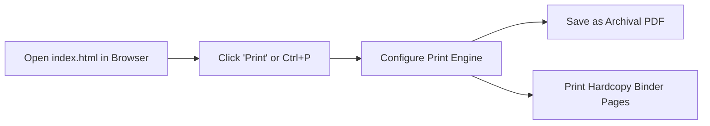

# Deployment, Hosting & Offline Resilience Guide

> **Project**: `211nj-help`  
> **Source Document**: [`index.html`](file:///c:/Users/Ryan/Desktop/211nj-help/index.html)  
> **Delivery Scope**: 100% Offline Air-Gapped Execution, Physical Print Archival, and Zero-Config Static Web Hosting

---

## Table of Contents
- [1. The Offline-First Imperative](#1-the-offline-first-imperative)
- [2. Local Air-Gapped & Mobile Usage](#2-local-air-gapped--mobile-usage)
- [3. Emergency "Go-Bag" USB Flash Drive Setup](#3-emergency-go-bag-usb-flash-drive-setup)
- [4. PDF Generation & Physical Household Binder](#4-pdf-generation--physical-household-binder)
- [5. Zero-Config Static Web Hosting](#5-zero-config-static-web-hosting)
- [6. Privacy, Security & Data Sovereignty](#6-privacy-security--data-sovereignty)

---

## 1. The Offline-First Imperative

Public benefit guides and emergency directories are most needed during crises:
* **Severe Weather & Power Grid Failures**: Camden County experiences severe winter blizzards and summer storms that knock out residential power and cable internet for days.
* **Cellular Data Caps & Budget Expirations**: Low-income households frequently rely on Lifeline or prepaid cellular data plans with strict high-speed monthly limits.
* **Utility Shutoffs & Disconnections**: When families face immediate service shutoffs, home broadband is often the first service suspended.

Because [`index.html`](file:///c:/Users/Ryan/Desktop/211nj-help/index.html) has **zero external HTTP requests and zero runtime dependencies**, it functions with 100% fidelity even when disconnected from the internet.

---

## 2. Local Air-Gapped & Mobile Usage

You do not need a web server or an internet connection to use `211nj-help`.

### Running on a Desktop Computer (Windows / macOS / Linux)
1. Download or copy [`index.html`](file:///c:/Users/Ryan/Desktop/211nj-help/index.html) to your local hard drive (e.g. Desktop, Documents).
2. Double-click the file, or open it in any browser:
   ```powershell
   # Windows PowerShell
   Start-Process "c:\Users\Ryan\Desktop\211nj-help\index.html"
   ```
3. All interactive features (checkboxes, progress bar, scroll-spy, and table formatting) work locally.

### Saving to a Smartphone or Tablet (Android / iOS)

#### Android:
1. Transfer or download [`index.html`](file:///c:/Users/Ryan/Desktop/211nj-help/index.html) to your device's internal storage (e.g., `Download` folder).
2. Open the file in Chrome, Samsung Internet, or Firefox.
3. Tap the browser menu (**⋮**) and select **Add to Home screen**.
4. The page is now accessible as a standalone web app icon on your home screen, opening instantly without an internet connection.

#### iPhone / iPad (iOS):
1. Save [`index.html`](file:///c:/Users/Ryan/Desktop/211nj-help/index.html) to the **Files** app (via AirDrop, iCloud Drive, or email attachment).
2. Open the file in Safari.
3. Tap the **Share** button (box with upward arrow) and select **Add to Home Screen**.
4. Tap **Add**. You now have an offline app icon that opens directly to the guide.

---

## 3. Emergency "Go-Bag" USB Flash Drive Setup

For emergency preparedness (e.g., house fires, sudden evictions, storm evacuations), keep an encrypted or password-protected USB flash drive containing:
1. A fresh copy of [`index.html`](file:///c:/Users/Ryan/Desktop/211nj-help/index.html).
2. A rendered PDF copy of the guide: `211nj-help-Sicklerville-2026.pdf`.
3. Digital scanned copies of the **"Gather these first" folder**:
   - Government-issued photo IDs and Social Security cards.
   - Most recent 2 years of tax returns (1040s) and recent paystubs.
   - Proof of address (lease, mortgage deed, recent utility bill).
   - Medical and disability documentation (autism diagnostic reports, IEP records, back treatment history).
   - Birth certificates for all household members.
   - Recent bank statements.

---

## 4. PDF Generation & Physical Household Binder

A physical printed binder guarantees that benefits contacts, legal scripts, and emergency numbers are accessible even if all phones and laptops are drained of battery.



### Step-by-Step Print Configuration
1. Open [`index.html`](file:///c:/Users/Ryan/Desktop/211nj-help/index.html) in Chrome, Edge, Safari, or Firefox.
2. Click the floating **Print** button in the lower right, or press `Ctrl + P` (`Cmd + P` on macOS).
3. **Print Dialog Settings**:
   - **Destination**: Choose your physical printer or select **Save as PDF**.
   - **Color**: Black & White (recommended for home printers to conserve ink; `@media print` automatically optimizes contrast) or Color.
   - **Margins**: **Default** (or **Minimum**).
   - **Options**: Ensure **Background graphics** is checked (this preserves subtle card borders and header tones).
4. **Physical Binder Assembly**:
   - Place the printed pages inside clear plastic sheet protectors in a standard 1-inch 3-ring binder.
   - Add tab dividers for high-frequency sections: *Crisis*, *Utilities*, *Food*, *Disability*, and *Phone Cheat Sheet*.
   - Store the binder alongside household vital records.

---

## 5. Zero-Config Static Web Hosting

If you wish to make the portal accessible online for family members, caseworkers, or neighbors, it can be hosted for free on any static web platform in seconds.

### Option 1: GitHub Pages (Recommended)
Because the repository is already hosted on GitHub at `https://github.com/Otterdays/211nj-help`:
1. Navigate to the repository settings: `https://github.com/Otterdays/211nj-help/settings/pages`.
2. Under **Build and deployment > Source**, select **Deploy from a branch**.
3. Under **Branch**, select `main` and set the folder to `/ (root)`.
4. Click **Save**.
5. Within 60 seconds, your site is live at:
   ```
   https://otterdays.github.io/211nj-help/
   ```

### Option 2: Cloudflare Pages / Vercel / Netlify
1. Connect the GitHub repository `Otterdays/211nj-help`.
2. Configure project settings:
   - **Framework Preset**: None / Other (Static HTML).
   - **Build Command**: *Leave blank* (no build step).
   - **Output Directory**: `.` (root).
3. Click **Deploy**. Deployments take under 5 seconds.

### Option 3: Local Network Sharing (LAN)
To share the guide across all computers and phones connected to your home Wi-Fi:
```powershell
# Using Python
cd c:\Users\Ryan\Desktop\211nj-help
python -m http.server 8080

# Using Node.js
npx serve .
```
Then visit `http://[YOUR-LOCAL-IP]:8080` from any phone or laptop on the local network.

---

## 6. Privacy, Security & Data Sovereignty

Civic assistance pages often handle sensitive demographic and medical contexts. `211nj-help` is engineered with total data privacy:
* **Zero Telemetry**: No Google Analytics, Meta Pixel, tracking beacons, or error reporting scripts.
* **Zero Cookies**: The portal sets zero HTTP cookies.
* **Client-Only Storage**: All checkbox interaction data is stored in your device's browser `localStorage` under the `qs211-*` keys. It is never transmitted across the network.
* **No Server Logs**: When opened via `file://`, no web server logs are generated.
* **HIPAA & PII Protection**: Because the portal does not transmit form data, families can review sensitive diagnostic and financial criteria with complete privacy.
