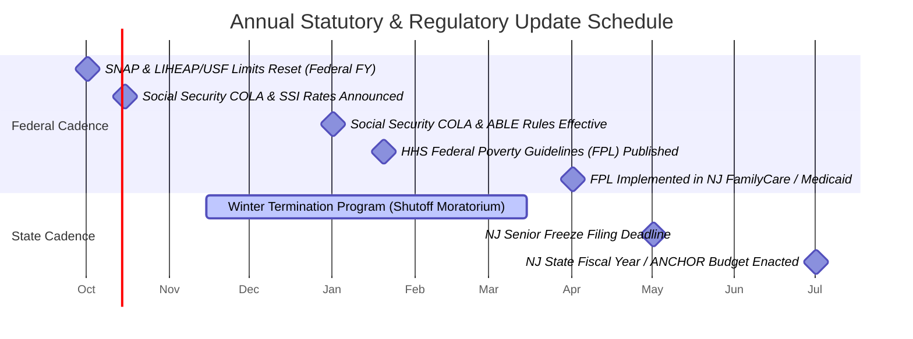
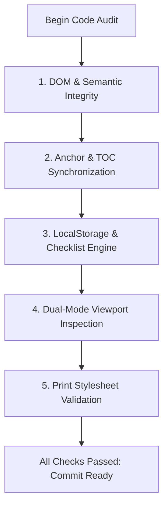

# Maintenance & Verification Lifecycle Guide

> **Project**: `211nj-help`  
> **Source Document**: [`index.html`](file:///c:/Users/Ryan/Desktop/211nj-help/index.html)  
> **Governance Model**: Statutory Calendar Auditing & Absolute Candor Protocol

---

## Table of Contents
- [1. Overview & Maintenance Objectives](#1-overview--maintenance-objectives)
- [2. Statutory & Regulatory Update Calendar](#2-statutory--regulatory-update-calendar)
- [3. Sources of Truth & Verification Methodology](#3-sources-of-truth--verification-methodology)
- [4. The Candor Protocol (`.unverified`)](#4-the-candor-protocol-unverified)
- [5. Technical QA & Regression Testing Checklist](#5-technical-qa--regression-testing-checklist)
- [6. Change Management & Release Workflow](#6-change-management--release-workflow)

---

## 1. Overview & Maintenance Objectives

Civic navigation portals decay quickly if not maintained. Federal and state agencies frequently adjust eligibility limits, sunset temporary grant programs, restructure telephone directories, or move online portals.

Inaccurate civic information can have serious consequences: a family might fail to apply for food assistance believing they earn too much, or conversely, risk losing SSI benefits by exceeding unmonitored asset caps.

**Maintenance Objectives**:
1. **Zero Silent Obsolescence**: All figures must carry clear verification timestamps.
2. **Explicit Qualification of Volatile Data**: Any item subject to policy fluctuation must be marked with `.unverified`.
3. **Continuous Cross-Check with Official Bulletins**: Align with published state and federal regulations rather than secondary aggregator websites.

---

## 2. Statutory & Regulatory Update Calendar

Benefit adjustments follow an annual calendar governed by federal and state fiscal years:



### 1. October 1 — Federal Fiscal Year (The Critical Reset)
* **Programs Affected**: NJ SNAP, LIHEAP, USF, HEA, and federal Standard Utility Allowances (SUA).
* **Required Actions**:
  - Update the [USF / LIHEAP monthly limits table](file:///c:/Users/Ryan/Desktop/211nj-help/index.html#L1076).
  - Update the [SNAP gross monthly limits table](file:///c:/Users/Ryan/Desktop/211nj-help/index.html#L1091).
  - Verify that the NJ minimum SNAP supplement ($95/month) remains active.
  - Update the `.verified-note` timestamp inside [`index.html`](file:///c:/Users/Ryan/Desktop/211nj-help/index.html#L1073).

### 2. January 1 — Social Security COLA & ABLE Adjustments
* **Programs Affected**: Supplemental Security Income (SSI), Social Security Disability Insurance (SSDI), and NJ ABLE accounts.
* **Required Actions**:
  - Update the individual and couple SSI federal rates in the [Cash Assistance panel](file:///c:/Users/Ryan/Desktop/211nj-help/index.html#L640) and [Marriage Question panel](file:///c:/Users/Ryan/Desktop/211nj-help/index.html#L1525).
  - Recalculate the couple penalty differential ($994 + $994 vs couple rate).
  - Verify IRS annual gift tax exclusion for annual ABLE contribution ceilings.

### 3. April 1 — Federal Poverty Level (FPL) Medicaid Realignment
* **Programs Affected**: NJ FamilyCare (MAGI Adult 138%, Child 355%, Pregnant 205%), NJ Charity Care hospital assistance (200% / 300% FPL), and Medicare Savings Programs (QMB, SLMB, QI).
* **Required Actions**:
  - Review and adjust monthly income limits in the [NJ FamilyCare table](file:///c:/Users/Ryan/Desktop/211nj-help/index.html#L1106).

### 4. July 1 — New Jersey State Fiscal Year
* **Programs Affected**: ANCHOR property tax / tenant relief rebates, Senior Freeze (PTR), and NJ State Supplement to SSI.
* **Required Actions**:
  - Update filing deadlines and maximum rebate amounts in the [Tax Relief panel](file:///c:/Users/Ryan/Desktop/211nj-help/index.html#L1650).

---

## 3. Sources of Truth & Verification Methodology

When verifying figures or URLs, consult only primary administrative sources:

| Program Area | Primary Source of Truth | Verification URL |
|---|---|---|
| **SNAP & WFNJ** | NJ DHS Division of Family Development (DFD) | [nj.gov/humanservices/dfd](https://www.nj.gov/humanservices/dfd/) |
| **Energy & Utilities** | NJ DCA Division of Housing & Community Resources | [energyassistance.nj.gov](https://energyassistance.nj.gov) |
| **Healthcare** | NJ FamilyCare / Division of Medical Assistance | [njfamilycare.dhs.state.nj.us](https://njfamilycare.dhs.state.nj.us) |
| **SSI & SSDI** | Social Security Administration COLA Fact Sheets | [ssa.gov/cola](https://www.ssa.gov/cola/) |
| **Developmental Aid** | NJ Division of Developmental Disabilities (DDD) | [nj.gov/humanservices/ddd](https://www.nj.gov/humanservices/ddd/) |
| **Child Crisis** | PerformCare New Jersey (Children's System of Care) | [performcarenj.org](https://www.performcarenj.org) |
| **Legal Aid** | Legal Services of New Jersey (LSNJLAW) | [lsnjlaw.org](https://www.lsnjlaw.org) |
| **Local Municipal** | Winslow Township Official Administration | [winslowtownship.com](https://winslowtownship.com) |
| **Library Passes** | Camden County Library System Museum Pass Desk | [camdencountylibrary.org](https://www.camdencountylibrary.org) |

### Telephony Verification Protocol
1. For every phone number listed in [`#phones`](file:///c:/Users/Ryan/Desktop/211nj-help/index.html#L2278):
   - Confirm the number connects to the designated public agency.
   - Note automated IVR options or dedicated disability extension lines.
   - Confirm that `<a href="tel:...">` has no dashes, parentheses, or letters in the protocol string (e.g., `href="tel:1-800-428-8476"` for `1-800-4-AUTISM`).

---

## 4. The Candor Protocol (`.unverified`)

A core innovation of `211nj-help` is its refusal to present uncertain policy interpretations as hard facts.

### Criteria for Flagging Content as `.unverified`
An item must be wrapped in `<p class="unverified">` if:
1. **Statutory Ambiguity**: Federal or state administrative rules leave enforcement to local agency discretion (e.g., SSA "holding out" marriage rule).
2. **Pending Legislation**: Bills introduced but not signed into law (e.g., federal marriage penalty relief bills).
3. **Temporal Variance**: Hours, seasonal dates, or event giveaways that change year-to-year and have not yet been posted by township officials.
4. **Discrepancy Between Official Sources**: When county guidance and state manuals cite differing figures or process timelines (e.g., PerformCare Mobile Response initial authorization phases).

### Standard Code Pattern for `.unverified`
```html
<p class="unverified">
  <strong>&#9888; Not fully confirmed:</strong> [Specific statement of uncertainty; identify source discrepancy; provide direct instruction on what the user or caseworker should verify].
</p>
```

### Removing `.unverified` Flags
A flag may only be removed when:
1. A contributor or agent verifies the exact current figure against an official primary document (administrative code, circular, or statutory text).
2. The explanatory text in the card is updated to reflect the confirmed reality.
3. The `.verified-note` for that section is updated.

---

## 5. Technical QA & Regression Testing Checklist

Run this audit whenever [`index.html`](file:///c:/Users/Ryan/Desktop/211nj-help/index.html) is updated:



### 1. DOM & Semantic Integrity
* Validate with an HTML linter or headless parser.
* Ensure all elements with an `id` attribute are unique:
  ```powershell
  # Test with PowerShell
  $c = Get-Content .\index.html -Raw
  $ids = [regex]::Matches($c, 'id="([^"]+)"') | ForEach-Object { $_.Groups[1].Value }
  $dups = $ids | Group-Object | Where-Object { $_.Count -gt 1 }
  if ($dups) { Write-Error "Duplicate IDs found!" } else { "All IDs unique." }
  ```

### 2. Anchor & TOC Synchronization
* Ensure that every `href="#[name]"` link in `<nav class="toc">` has a corresponding DOM element with `id="[name]"`:
  ```powershell
  $hrefs = [regex]::Matches($c, 'href="#([^"]+)"') | ForEach-Object { $_.Groups[1].Value } | Select-Object -Unique
  $missing = $hrefs | Where-Object { $ids -notcontains $_ }
  if ($missing) { Write-Error "Missing targets: $($missing -join ', ')" } else { "All TOC links valid." }
  ```

### 3. LocalStorage & Checklist Engine
* Open the portal in a browser, check 3 boxes, and refresh.
  - Verify that the 3 boxes remain checked.
  - Verify that the count displays `3 of 8 complete` and progress bar shows `38%`.
* Click the **Reset** button.
  - Verify that all checkboxes clear and storage keys are removed.
* Verify that clicking the text of a checklist item toggles the checkbox, while clicking a hyperlink inside that item navigates to the target URL without toggling the checkbox.

### 4. Dual-Mode Viewport Inspection
* **Desktop (>820px)**:
  - Scroll down the page; verify that `#top-btn` appears smoothly after 400px.
  - Verify that the sidebar `.toc` stays fixed in place and highlights the current section as you scroll.
* **Mobile (≤820px)**:
  - Verify that the TOC transitions to a sticky top bar.
  - Swipe horizontally through the pill tabs; verify smooth scrolling.
  - Click a pill tab; verify that the pill highlights and centers itself horizontally.

### 5. Print Stylesheet Validation
* Open print preview (`Ctrl + P` / `Cmd + P`).
* Confirm that:
  - `#top-btn`, `#print-btn`, and `#qs-reset` are hidden.
  - Panels do not have awkward splits across page breaks (`break-inside: avoid;`).
  - Colors are ink-efficient and high contrast.

---

## 6. Change Management & Release Workflow

When publishing updates:
1. **Branch or Stash Cleanly**: Work on a clean branch if modifying large sections.
2. **Atomic Commits**: Group content updates logically:
   - `fix(data): update 2027 SNAP and LIHEAP income limits`
   - `feat(local): add new food pantry in Winslow Twp`
   - `style(print): improve table row contrast in print mode`
3. **Update Timestamps**: Update the header subtitle in [`index.html`](file:///c:/Users/Ryan/Desktop/211nj-help/index.html#L545) and the footer note in [`index.html`](file:///c:/Users/Ryan/Desktop/211nj-help/index.html#L2348).
