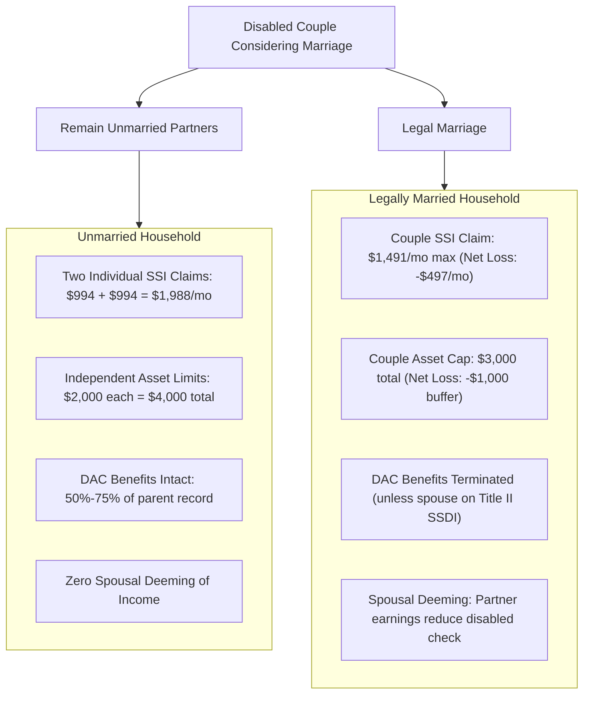

# Programs & Benefits Policy Reference Guide

> **Project**: `211nj-help`  
> **Source Document**: [`index.html`](file:///c:/Users/Ryan/Desktop/211nj-help/index.html)  
> **Geographic Jurisdiction**: Sicklerville, Winslow Township, Camden County, New Jersey  
> **Effective Regulatory Baseline**: 2026–2027 Program Year (Verified October 2026)

---

## Table of Contents
- [1. Cash Assistance & Income Maintenance](#1-cash-assistance--income-maintenance)
- [2. Disability Programs & Asset Shielding](#2-disability-programs--asset-shielding)
- [3. Food, Nutrition & Healthcare Programs](#3-food-nutrition--healthcare-programs)
- [4. Child Care, Special Education & Youth Crisis](#4-child-care-special-education--youth-crisis)
- [5. Housing, Eviction Defense & Home Repair](#5-housing-eviction-defense--home-repair)
- [6. Utility Assistance & Energy Efficiency](#6-utility-assistance--energy-efficiency)
- [7. Transportation & Auto Insurance Programs](#7-transportation--auto-insurance-programs)
- [8. Deep Policy Analysis: The Marriage Question](#8-deep-policy-analysis-the-marriage-question)
- [9. Cross-Program Benefit Optimization ("Hacks")](#9-cross-program-benefit-optimization-hacks)

---

## 1. Cash Assistance & Income Maintenance

### Work First New Jersey (WFNJ)
Administered by the **Camden County Board of Social Services (BSS)** via the unified [MyNJHelps](https://www.njhelps.gov) portal.
* **TANF (Temporary Assistance for Needy Families)**: Monthly cash aid for low-income families with dependent children. Requires participation in approved work or educational activities unless medically exempt. Automatically confers NJ FamilyCare (Medicaid) coverage.
* **General Assistance (GA)**: Monthly cash benefits for single adults and couples without dependent children who are unemployed or incapacitated.
* **Camden County BSS Contact**: Phone: `856-225-8800`.

### Supplemental Security Income (SSI)
Administered federally by the **Social Security Administration (SSA)** under Title XVI.
* **Target Demographic**: Low-income adults and children with severe, medically determinable physical or mental impairments that prevent substantial gainful activity (SGA).
* **2026 Federal Benefit Rates**:
  - Individual: **$994 / month** (plus small New Jersey State Supplement).
  - Couple (both eligible): **$1,491 / month** total.
* **Asset & Resource Limits**:
  - Individual: **$2,000**.
  - Married Couple: **$3,000**.
  - *Excluded Assets*: Primary home, one primary vehicle, household goods, burial plots, and funds held within qualified **NJ ABLE accounts** up to $100,000.
* **Automatic Medicaid Concurrence**: In New Jersey, an approved SSI award automatically confers categorical NJ FamilyCare (Medicaid) eligibility with zero secondary application required.

### Social Security Disability Insurance (SSDI)
Administered by SSA under Title II.
* **Eligibility Basis**: Financed through FICA payroll taxes. Requires sufficient earned work credits (based on age at disability onset).
* **Payment Amounts**: Calculated from the worker's average lifetime covered earnings (often substantially higher than SSI).
* **Medicare Bridge**: Individuals awarded SSDI qualify for federal Medicare after a statutory **24-month waiting period**.

---

## 2. Disability Programs & Asset Shielding

### Childhood Disability Benefits (DAC / Disabled Adult Child)
A critical, often overlooked Title II Social Security provision.
* **Criteria**: If an individual has a severe disability that began **before age 22** (such as autism spectrum disorder or developmental conditions), they can draw monthly benefits based on a **parent's Social Security earnings record** once that parent:
  1. Retires and begins receiving Social Security,
  2. Becomes disabled and receives SSDI, or
  3. Dies.
* **Payment Scale**:
  - Parent alive (retired/disabled): **50%** of the parent's primary insurance amount (PIA).
  - Parent deceased: **75%** of the parent's PIA.
* **Medicare Link**: DAC recipients qualify for Medicare after 24 months of entitlement.
* **Critical Trap**: Entitlement to DAC typically **terminates upon marriage**, unless the marriage is to another Title II Social Security disability beneficiary.

### NJ ABLE Accounts (Achieving a Better Life Experience)
Administered via [Save With ABLE NJ](https://savewithable.com/nj) under Section 529A of the Internal Revenue Code.
* **Statutory Expansion (Effective Jan 1, 2026)**: Disability onset age limit increased from age 26 to **age 46**.
* **Asset Shielding Mechanism**:
  - Balances up to **$100,000** are explicitly ignored for SSI resource calculations.
  - Balances do not count toward Medicaid asset tests.
* **Eligible Qualified Disability Expenses (QDE)**: Housing, rent, utilities, education, medical co-pays, transportation, assistive technology, legal fees, and personal assistance services.

### NJ Division of Developmental Disabilities (DDD) Supports Program
Administered by the **NJ Department of Human Services (DHS)** for adults aged 21 and older.
* **Target Audience**: Adults with developmental or intellectual disabilities diagnosed before age 22 (e.g. autistic adults).
* **Supports Program**: Provides annual Medicaid-waiver funding for day services, assistive technology, respite care, therapy, and employment support.
* **Self-Directed Option**: Permits participants to self-direct their budget and hire support staff directly—including family members or spouses in qualified arrangements.

---

## 3. Food, Nutrition & Healthcare Programs

### New Jersey SNAP (Supplemental Nutrition Assistance Program)
Administered by Camden County BSS via MyNJHelps.
* **Gross Income Test**: Expanded Categorical Eligibility (ECE) sets New Jersey's income ceiling at **185% of the Federal Poverty Level (FPL)**.
* **2026–2027 Gross Income Limits (Effective Oct 1, 2026)**:
  - 1 Person: **$2,461 / month**
  - 2 People: **$3,337 / month**
  - 3 People: **$4,212 / month**
  - 4 People: **$5,088 / month**
* **New Jersey State Minimum Benefit**: Under New Jersey state law, the minimum monthly SNAP allotment is supplemented to **$95 / month** (preventing the federal $23 minimum cliff).
* **Medical Expense Deduction**: Households containing an elderly (60+) or disabled individual can deduct out-of-pocket medical expenses exceeding **$35 / month** from gross income, significantly boosting the net SNAP allotment.

### NJ FamilyCare (Medicaid Expansion & CHIP)
New Jersey's publicly funded health coverage system.
* **Modified Adjusted Gross Income (MAGI) Categories**:
  - Adults (19–64): Up to **138% FPL** (~$1,835/mo for a single adult in 2026).
  - Children (<19): Up to **355% FPL** (~$9,763/mo for a family of 4).
  - Pregnant Women: Up to **205% FPL** (includes 12 months continuous postpartum coverage).
* **Asset Limits**: None for MAGI categories.
* **Pediatric Autism Coverage**: Under Early and Periodic Screening, Diagnostic and Treatment (EPSDT), NJ FamilyCare covers medically necessary Applied Behavior Analysis (ABA), physical therapy, occupational therapy, and speech therapy for eligible youth under age 21.

### NJ Charity Care (Hospital Care Payment Assistance)
State-mandated free or reduced-cost emergency and inpatient care for uninsured or underinsured patients at acute care hospitals across New Jersey (e.g. Virtua, Cooper, Jefferson Health).
* **0%–200% FPL**: 100% charity care discount (completely free care).
* **201%–300% FPL**: Sliding-scale fee assistance.

---

## 4. Child Care, Special Education & Youth Crisis

### Child Care Assistance Program (CCAP)
Subsidizes child care for working families, parents enrolled in full-time education, or job-training programs via Camden County Department of Children's Services.
* Administered through the unified [Child Care NJ](https://www.childcarenj.gov) portal and MyNJHelps.
* Sliding-scale co-pays based on household income.

### Child Study Team (CST) & Individualized Education Programs (IEP)
Under the federal Individuals with Disabilities Education Act (IDEA) and NJ Administrative Code 6A:14:
* **The Request**: Parents have the legal right to submit a written request to the school principal or CST director for a comprehensive evaluation.
* **Timeline**: The district must convene an identification meeting within **20 calendar days** of receiving written parental consent.
* **Advocacy Partner**: **SPAN Parent Advocacy Network** (`1-800-654-7726`) provides free legal support and training for New Jersey parents navigating IEP and 504 plan meetings.

### PerformCare Children's System of Care & Mobile Response (MRSS)
* **24/7 Crisis Hotline**: `877-652-7624`.
* **Mobile Response and Stabilization Services (MRSS)**: Dispatches a trained crisis response clinician directly to the family's home in Camden County **within 1 hour** to de-escalate severe behavioral or emotional crises, avoiding unnecessary emergency room visits or police involvement.
* **In-Home Respite & Family Supports**: PerformCare can fund respite care hours, assistive technologies, and adaptive equipment for youth with developmental disabilities.

---

## 5. Housing, Eviction Defense & Home Repair

### New Jersey Eviction Defense Rights
Tenants in New Jersey have some of the strongest anti-eviction protections in the United States under the **Anti-Eviction Act** (N.J.S.A. 2A:18-61.1):
1. **Self-Help Lockouts are Illegal**: A landlord cannot change locks, shut off utilities, or remove belongings without a formal court judgment and a Warrant of Removal executed by a Special Civil Part Officer. Illegal lockouts must be reported to the local police (Winslow Police: `609-561-3300`).
2. **Pay-and-Stay**: In non-payment cases, a tenant has the legal right to dismiss the eviction action by paying all owed rent plus permitted court costs up until the judgment date.
3. **3-Day Post-Lockout Cure Window**: Even after a physical lockout by a court officer for unpaid rent, the tenant has **3 business days** to pay the full balance (landlords must accept emergency rental assistance or charitable voucher guarantees).
4. **Hardship Stay**: Tenants facing imminent homelessness can petition the court for an Order for Orderly Removal or a Hardship Stay of up to **6 months** if rent can be paid prospectively.
5. **Free Legal Assistance**: **Legal Services of New Jersey (LSNJLAW)**: `1-888-576-5529`.

### Camden County Home Improvement Program (HIP)
* Administered by the Camden County Improvement Authority (CCIA): `856-751-2242`.
* Provides up to **$20,000** in forgivable, zero-interest deferred loans for income-qualified homeowners to repair critical home systems (roofs, HVAC, plumbing, electrical, structural). Loan is forgiven over time if the owner remains in the home.

### USDA Section 504 Home Repair Loans & Grants
* Provides low-interest (1%) loans up to $40,000 and direct grants up to $10,000 to very-low-income rural and suburban homeowners to repair safety hazards or modernize access for family members with disabilities.

---

## 6. Utility Assistance & Energy Efficiency

### Unified Tri-Utility Assistance (USF / LIHEAP / LIHWAP)
Administered through the unified [DCAid Energy Assistance Portal](https://energyassistance.nj.gov).
* **LIHEAP (Low Income Home Energy Assistance Program)**: Seasonal grants applied directly to heating and cooling bills (natural gas, electric, heating oil, propane).
* **USF (Universal Service Fund)**: Monthly credits applied directly to gas and electric bills to cap energy costs at 6% of household income.
* **Monthly Gross Limits (Oct 1, 2026 – Sep 30, 2027)**:
  - 1 Person: **$4,167**
  - 2 People: **$5,449**
  - 3 People: **$6,732**
  - 4 People: **$8,014**

### New Jersey SHARES (NJ SHARES)
* Emergency grants up to **$500** for electric, natural gas, and municipal water/wastewater arrears for families experiencing temporary hardship (`866-657-4273`).

### Winter Termination Program (WTP)
* State-mandated utility shutoff moratorium effective **November 15 through March 15**.
* Regulated utilities (South Jersey Gas, Atlantic City Electric, PSE&G) cannot disconnect residential service for customers receiving LIHEAP, USF, SNAP, SSI, or TANF.
* Customers must request enrollment and establish a reasonable payment arrangement.

---

## 7. Transportation & Auto Insurance Programs

### Special Automobile Insurance Policy (SAIP / "Dollar-A-Day")
* **Target Audience**: Low-income drivers receiving federal Medicaid with hospitalization coverage.
* **Annual Cost**: **$365 / year** (payable in two $182.50 installments) or **$360** if paid upfront.
* **Coverage Scope**: Covers emergency medical expenses up to $250,000 in the event of an automobile accident, plus a $10,000 death benefit. Satisfies New Jersey's mandatory automobile insurance requirement, allowing legal vehicle operation at nominal cost.
* **Phone**: `1-800-652-2471`.

### Access Link (ADA Paratransit)
* NJ Transit's paratransit service for people with disabilities who cannot utilize regular fixed-route bus service.
* Operates within a 3/4-mile corridor around active local bus and light-rail routes.
* Fares match standard bus transit fares.
* **Phone**: `973-491-4224`.

### Modivcare (Medicaid Non-Emergency Medical Transportation)
* Provides free door-to-door rides to medical, therapy, and pharmacy appointments for all active NJ FamilyCare (Medicaid) beneficiaries.
* Requires booking 48–72 hours in advance.
* **Reservations**: `1-866-527-9933`.

---

## 8. Deep Policy Analysis: The Marriage Question

For low-income households with disabled members, legal marriage carries severe financial and benefits penalties under federal statutory frameworks:

### The Federal SSI Marriage Penalty
1. **Direct Cash Reduction**: Two unmarried individuals on SSI receive $994 + $994 = **$1,988 / month**. Once married, they receive the couple maximum of **$1,491 / month**—an immediate, permanent **loss of $497 / month ($5,964 / year)**.
2. **Deeming of Income**: If only one spouse receives SSI while the other works, SSA applies "spousal deeming" formulas. The working spouse's earnings directly dollar-reduce the disabled partner's SSI check, frequently eliminating both the monthly check and categorical Medicaid eligibility.
3. **Compressed Asset Cap**: Single individuals can retain up to $2,000 in liquid assets ($4,000 combined). Married couples are capped at **$3,000**, forcing lower emergency cash reserves.

### Childhood Disability Benefits (DAC) Elimination
Under Section 202(d) of the Social Security Act, an individual receiving DAC benefits on a retired, disabled, or deceased parent's earnings record **forfeits their entitlement upon marriage**.
* *Exception*: Marriage to another individual entitled to Title II Social Security disability benefits (such as SSDI).
* *Risk*: If an autistic adult receiving $1,400/month DAC on a parent's record marries a non-beneficiary, the DAC benefit and related Medicare coverage terminate.

### The SSA "Holding Out" Doctrine
Under 20 CFR § 416.1806, SSA evaluates whether an unmarried couple is "holding out to the community as spouses" (e.g. sharing a last name, introducing each other as "my husband/wife," filing joint tax forms, or sharing spousal bank accounts).
* If SSA determines a couple is "holding out," they are treated as married for SSI calculations even without a civil marriage license.
* **Best Practice**: Be transparent with SSA regarding unmarried partner status; maintain individual financial accounts.

### Legal Alternatives to Protect Autonomy
Unmarried couples can establish legal protections without civil marriage:
* **Medical Durable Power of Attorney & Healthcare Proxy**: Designates the partner as the primary healthcare decision-maker in medical emergencies.
* **HIPAA Release Forms**: Permits hospital and clinical staff to share medical information.
* **Durable Financial Power of Attorney**: Empowers the partner to manage household bills, lease obligations, and benefits paperwork.
* *Available through Legal Services of New Jersey (LSNJLAW)*.

---

## 9. Cross-Program Benefit Optimization ("Hacks")

Legitimate, statutory strategies to maximize household benefit awards:

### 1. The "Heat-and-Eat" Strategy (LIHEAP + SNAP SUA)
* **Mechanism**: In New Jersey, receiving even a nominal energy assistance benefit ($21+) qualifies a household for the maximum **Heating/Cooling Standard Utility Allowance (HCSUA)** deduction in SNAP calculations.
* **Impact**: Adding the HCSUA shelter deduction reduces net household income on paper, significantly increasing monthly food stamp allotments.
* **Action**: Always apply for LIHEAP/USF even if utility balances are small.

### 2. Elderly/Disabled Medical Deduction Threshold
* **Rule**: In NJ SNAP, households containing an individual with a recognized disability (SSI, SSDI, or documented impairment) can deduct all verified, non-reimbursed medical expenses exceeding **$35 / month**.
* **Eligible Costs**: Prescription co-pays, over-the-counter doctor-recommended supplies, physical therapy, transportation mileage to doctor visits, dental expenses, and mental health therapy.
* **Impact**: Lowers calculated net income toward maximum SNAP allocations.

### 3. NJ ABLE Shielding for Family Gifts
* **Problem**: Cash gifts or inheritances exceeding $2,000 disqualify disabled individuals from SSI and Medicaid.
* **Solution**: Family members can deposit gifts directly into an **NJ ABLE account** (up to $18,000/year annual gift limit). Funds grow tax-free and do not count toward SSI's $2,000 asset limit.

### 4. DDD Self-Direction Family Caregiver Compensation
* Under the NJ DDD Supports Program Medicaid waiver, self-directed budgets can be allocated to hire Personal Care Assistants (PCAs).
* Under approved waiver guidelines, qualified family members or co-habiting partners can be hired as legitimate support providers, converting caregiving labor into legitimate household earned income.
